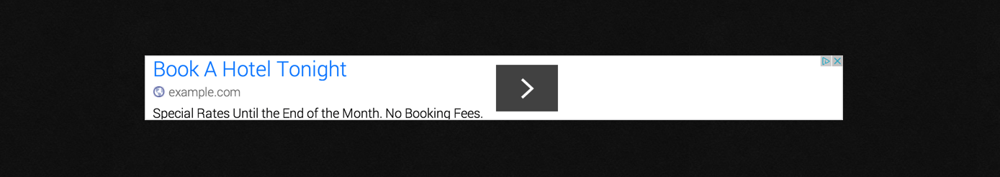
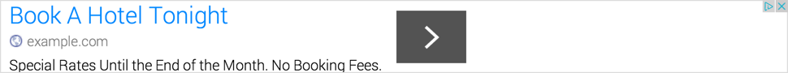

# [][project]

## The **Adsense** plugin for [Grav](https://getgrav.org) introduces integration of Adsense blocs for your modular page and your page content.

#### Table of Contents:

-   [About](#about)
-   [Installation and Updates](#installation-and-updates)
-   [configuration](#configuration)
-   [Usage](#usage)
-   [Contributing](#contributing)
-   [Credits](#credits)
-   [License](#license)

## About

`AdSense` is a plugin for [**Grav**](http://getgrav.org) that let you add Adsense blocs to some place in your modular page and/or page content. 



For modular page, plugin allow user to define default `horizontal`, `vertical` or `square` Ad.

For page content, plugin allow user to define a list of Adsense blocs and integrate it through [Shortcode](https://github.com/getgrav/grav-plugin-shortcode-core).

The following kinds of Adsense are compatible:
- [Graphic and Text Ads](https://support.google.com/adsense/answer/185666?hl=en)
- [InArticle Ads](https://adsense.googleblog.com/2017/07/introducing-adsense-native-ads.html)
- [Auto Ads](https://adsense.googleblog.com/2018/02/introducing-adsense-auto-ads.html)

## Installation

Installing the `Adsense` plugin can be done in one of two way: GPM (Grav Package Manager) installation method enables you to quickly and easily install the plugin with a simple terminal command, while the manual method enables you to do so via a zip file or GIT.

### GPM Installation (Preferred)

The simplest way to install this plugin is via the [Grav Package Manager (GPM](http://learn.getgrav.org/advanced/grav-gpm) through your system's Terminal (also called the command line). From the root of your Grav install type:

    $ bin/gpm install adsense

This will install the `Adsense` plugin into your /user/plugins directory within Grav. Its files can be found under `user/plugins/adsense`.

### Manual Installation (Download)

To install this plugin, just download the zip version of this repository and unzip it under:

    user/plugins/adsense

## Configuration

Configuration can be done by the **Admin Panel** or by the configuration file `adsense.yaml` into your `users/config/plugins/` folder:

```yaml
# Global plugin configurations

enabled: true             # Set to false to disable this plugin completely
sandbox: false            # Enables a demo mode for local purpose
built_in_css: true        # Use the default plugin CSS
add_editor_button: true   # Add an Adsense button to Admin panel in order to add Adsense tag template
use_auto_ads: false       # Use Auto Ads in page (new feature of Google Adsense)

# Default configurations for AdSense

adsense:
  options:
    mode: "async"        # Code integration mode (either "async" or "sync")
    position: "center"   # Ad position in page (either "center", "left" or "right")
    auto_ads_client: ""     # Auto Ads client ID (like ca-pub-0000000000000000)
    auto_ads_filter:        # Filter of URN pages used to load Auto Ads. Nothing means All pages (Non filtered)
      - blog
      - portfolio
  page_ads:              # Ad blocs for page content
    -                    # List of ad blocs
      id: unique-id                         # Unique Id for the Ad
      client: ""                            # AdSense client (like ca-pub-0000000000000000)
      slot: 0000000000                      # AdSense slot
      type: inarticle                       # Adsense type (either "inarticle" or "normal")
      width: 468                            # Adsense width
      height: 60                            # Adsense height

  modular_ads:          # Ad blocs for modular page (as default)
    horizontal:         # For Horizontal Ad
      client: ""                            # AdSense client (like ca-pub-0000000000000000)
      slot: 0000000000                      # AdSense slot
      width: 728                            # Adsense width
      height: 90                            # Adsense height
    vertical:         # For Vertical Ad
      client: ""                            # AdSense client (like ca-pub-0000000000000000)
      slot: 0000000000                      # AdSense slot
      width: 200                            # Adsense width
      height: 600                           # Adsense height
    square:         # For Square Ad
      client: ""                            # AdSense client (like ca-pub-0000000000000000)
      slot: 0000000000                      # AdSense slot
      width: 300                            # Adsense width
      height: 300                           # Adsense height
```

## Usage

There are many ways to use `Adsense` plugin.

### Auto Ads

_Auto Ads_ is a new feature of *Google Adsense*. More informations are available here:

[https://adsense.googleblog.com/2018/02/introducing-adsense-auto-ads.html](https://adsense.googleblog.com/2018/02/introducing-adsense-auto-ads.html)

To use _Auto Ads_ in `Adsense` plugin, you just configure `use_auto_ads` to *true* and `adsense.options.auto_ads_client` to your *Auto Ads client ID*.

To add filtered URN items for Auto Ads treatment, please add items in parameter `adsense.options.auto_ads_filter`.  
When nothing is set, all pages load Auto Ads.  
When an item is set, URN with this item load Auto Ads.  
When a filter is set and you want to load Auto Ads for URN `/` ressource, please add the key `home`to filter list.

### By Shortcode

Using Shortcode allow user to integrate Adsense bloc in page content. There are 2 ways:

- Using unique ID

```md
[adsense id="my-id"][/adsense]
```

It look for the adsense bloc with unique ID  `id` in the configuration list `page_ads` and display the Ad.

- Using specific Adsense informations

```md
[adsense client="adsense-client" slot="adsense-slot" width="adsense-width" height="adsense-height" type="adsense-type"][/adsense]
```

It display the Ad with the tag informations.  
`type` can be :
- `inarticle` for InArticle Ad
- `normal` or _without value_ for Graphic and Text Ad

In case of  InArticle Ad, `width` and `height` is **not** mandatory.

> "Unique ID" have priority on "specific Adsense informations".

> The optional parameter `[class]` can be added to the tag.

### By modular integration

There are 2 ways for integration of this plugin using modular method:
- Using default configuration: User have possibility to modify and change Ad configuration through `Admin panel`.
- Using fixed configuration: User shall modify the modular page template to update Ad informations.

#### Default configuration

Modular integration using default configuration allow user to add default Ad in theming of **Grav** website reachable from Admin Panel. User have possibility to choose among 3 kinds of Ad:

- The Horizontal Ad

This way display an Ad in horizontal format by adding the following lines in your theme skeleton:

```twig

```

Render demo:  


- The Vertical Ad

This way display an Ad in vertical format by adding the following lines in your theme skeleton:

```twig

```

Render demo:  


- The Square Ad

This way display an Ad in square format by adding the following lines in your theme skeleton:

```twig

```

Render demo:  


#### Fixed configuration

Modular integration using fixed configuration allow user to add a bloc Ad in template of modular page. The following code is used:

```twig






```

## Migration from 1.x to 2.x

Migration is simple: rename the file `user/config/plugins/adsense2.yaml` to `user/config/plugins/adsense.yaml`, or redo your plugin configuration.

## Contributing

You can contribute at any time but before opening any issue, please search for existing issues.

After that please note:

-   If you find a bug, would like to make a feature request or suggest an improvement, [please open a new issue][issues]. If you have any interesting ideas for additions to the syntax please do suggest them as well!
-   Feature requests are more likely to get attention if you include a clearly described use case.
-   Add images/links/etc so I can help you faster

Thanks!

## Credits

- [Adsense Grav Plugin](https://github.com/muuvmuuv/grav-plugin-adsense) of [Marvin Heilemann](https://github.com/muuvmuuv/): Initialized by Marvin H.
- [Shortcode Core](https://github.com/getgrav/grav-plugin-shortcode-core)

## License

Copyright (c) 2019 [clemdesign][github].

For use under the terms of the [MIT][mit-license] license.

[github]: https://github.com/clemdesign/ "GitHub account from Clemdesign"

[mit-license]: http://www.opensource.org/licenses/mit-license.php "MIT license"

[project]: https://github.com/clemdesign/grav-plugin-adsense

[issues]: https://github.com/clemdesign/grav-plugin-adsense/issues "GitHub Issues for Grav Adsense Plugin"
